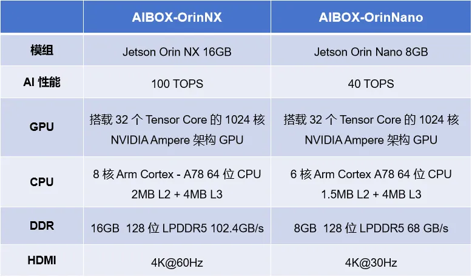
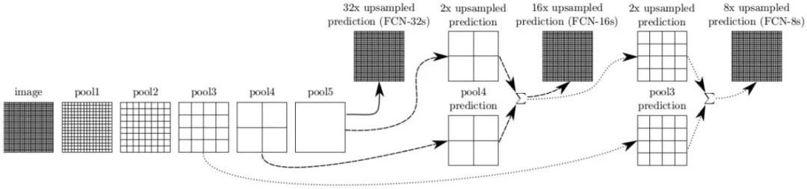
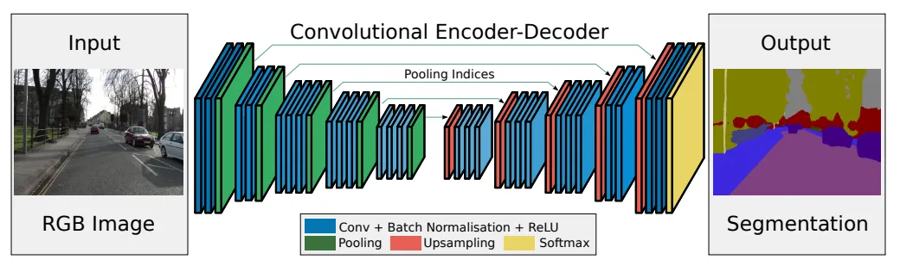
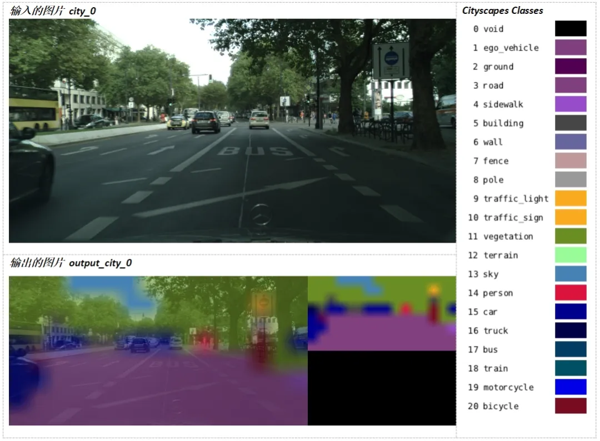

# NVIDIA AIBOX + TensorRT：打造高性能实时语义分割应用

## NVIDIA 系列 AIBOX ​

AIBOX-OrinNano 和 AIBOX-OrinNX 均搭载 NVIDIA 原装 Jetson Orin 核心板模组，标配工业级全金属外壳，铝合金结构导热，顶盖外壳侧面采用条幅格栅设计，高效散热，保障在高温运行状态下的运算性能和稳定性，满足各种工业级的应用需求。



## NVIDIA TensorRT

NVIDIA 系列 AIBOX 支持深度学习框架 TensorRT，TensorRT 是用于高性能深度学习推理的 API 生态系统，其包括推理运行时和模型优化，可为生产应用提供低延迟和高吞吐量。

TensorRT 生态系统包括 TensorRT、TensorRT-LLM、TensorRT 模型优化器和 TensorRT Cloud。

**NVIDIA TensorRT 的优势**

（1）推理速度提升 36 倍

（2）优化推理性能

（3）加速各种工作负载

（4）使用 Triton 进行部署、运行和扩展

## 语义分割

语义分割基于图像识别，但分类是在像素级别进行的，而不是在整个图像上进行。这是通过将预训练的图像识别骨干网络进行卷积化来实现的，将模型转换为能够进行逐像素标注的全卷积网络（FCN）。语义分割对于环境感知特别有用，它能够对每个场景中的许多不同潜在对象（包括前景和背景）进行密集的逐像素分类。



### SegNet 模型

SegNet 的新颖之处在于解码器对其较低分辨率的输入特征图进行上采样的方式。具体地说，解码器使用了在相应编码器的最大池化步骤中计算的池化索引来执行非线性上采样。经上采样后的特征图是稀疏的，因此随后使用可训练的卷积核进行卷积操作，生成密集的特征图。SegNet 的架构与广泛采用的 FCN 以及众所周知的 DeepLab-LargeFOV，DeconvNet 架构进行比较。比较的结果揭示了在实现良好的分割性能时所涉及的内存与精度之间的权衡。



### 下载源码

```
$ git clone --recursive --depth=1 https://github.com/T-Firefly-Dev/Nvidia_TensorRT
```

### 编译 / 安装

> 参考：https://github.com/T-Firefly-Dev/Nvidia_TensorRT/blob/master/docs/building-repo-2.md

### 运行示例

```
$ ./segnet.py --network=fcn-resnet18-cityscapes city_0.jpg output_city_0.jpg
```


